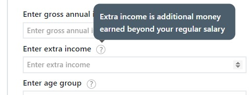
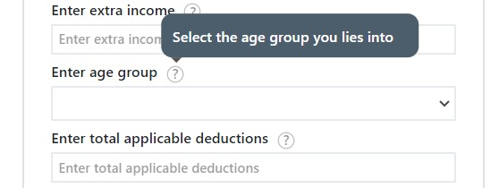

## Total annual income calculator

##### This is tital Income calculator 
 
[!NOTE]
> This application will calculate total annual income after tax deduction.
> We have to feed 
 * Gross annual income
 * Enter extra income
 * Age group
 * Applicable deduction

### Assignment Requirements

* [x] The tax calculation works based on below formula 
    * Formula: Gross Annual Income + Extra Income - Deductions
* [x] Do not restrict user from entering incorrect values like characters in the number fields
    * [X]  Highlight a error icon if there is an error
* [x] Error icons should not be visible in the form by default.
* [x] Clicking on submit should show a modal which would show the final values based on above calculations.
* [x] Deliverables
    * [x] A Github repo link(public)
    * [x] Link to the hosted Web App.
    * [x] Screenshot of all tests passing inside the readme

### images and their description

> This is the Annual income information tooltip image hovering over the "?" shows the tooltip

> This is the Extra income information tooltip image hovering over the "?" shows the tooltip

> This is the Age group information tooltip image hovering over the "?" shows the tooltip

> This is the annually deduction in income information tooltip image hovering over the "?" shows the tooltip

> This is the image of alert shown when the Annual income has non numerical strings as input and hit the submit button

> This is the image of alert shown when some fields are empty and hit the submit button

> This is the image of output modal when enter all the data correctly and hit the submit button

[!NOTE]
> I have added 2 image on my own other than given in the assignment
> 1st image on landing page and 2nd on output modal